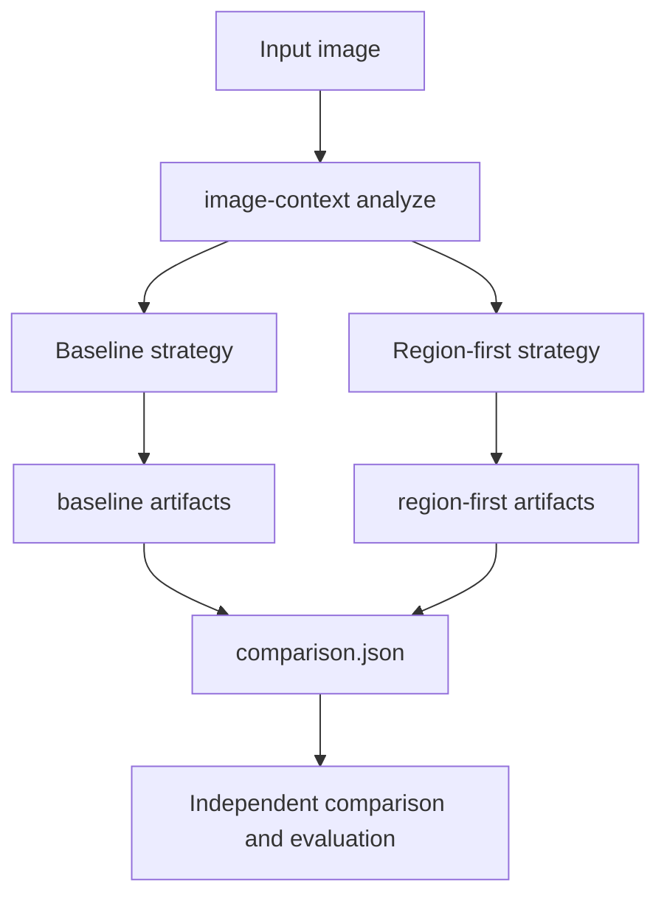

# Image Context Documentation

Esta pasta documenta a arquitetura, os fluxos de execução e os artefatos do projeto `image-context`.

O projeto mantém duas estratégias de análise que podem coexistir sobre a mesma imagem:

- `baseline`, orientada por conceitos produzidos pelo VLM antes de grounding e segmentação.
- `region-first`, orientada por regiões visuais descobertas antes da interpretação semântica.

## Conteúdo

- [architecture.md](architecture.md), visão arquitetural e responsabilidades dos componentes.
- [pipelines.md](pipelines.md), fluxos detalhados das estratégias `baseline` e `region-first`.
- [execution.md](execution.md), comandos CLI, retomada, fingerprints e carregamento dos modelos.
- [artifacts.md](artifacts.md), estrutura de saída e relação entre os artefatos persistidos.

## Visão geral

As estratégias compartilham a mesma entrada, mas gravam estados, caches e resultados em diretórios independentes. Isso permite comparar abordagens sem que a execução ou sobrescrita de uma estratégia remova os resultados da outra.
