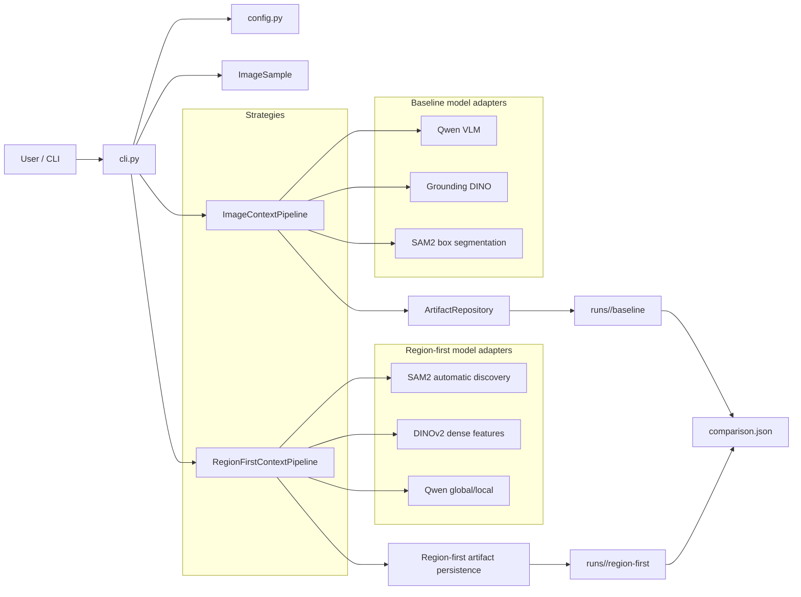
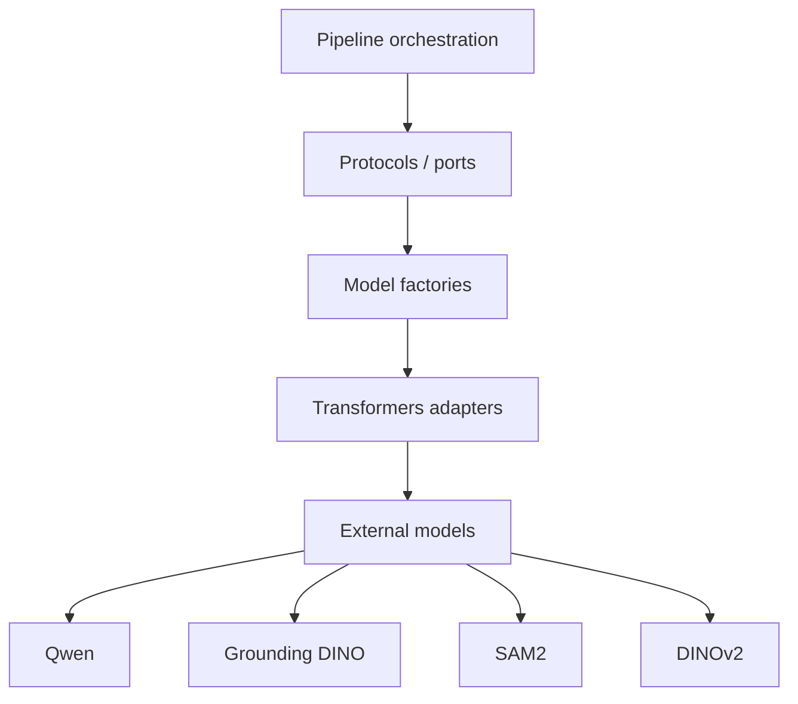
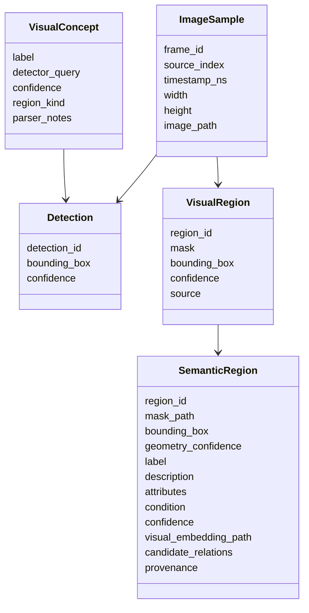
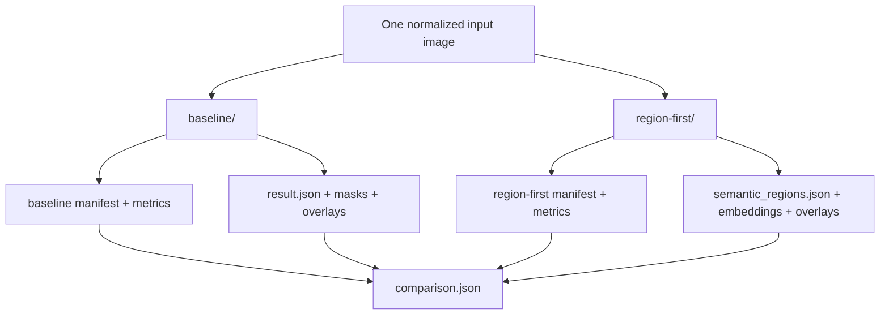
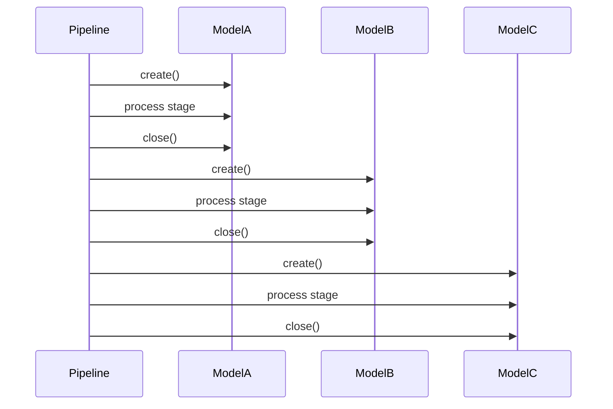

# Architecture

## Objetivo

`image-context` é um laboratório de percepção visual para comparar estratégias de enriquecimento contextual de imagens antes de integrar os resultados a pipelines maiores de mapeamento semântico/contextual.

A arquitetura separa:

- entrada e preparação da imagem;
- orquestração da estratégia;
- adaptadores de modelos pesados;
- contratos de dados;
- persistência de artefatos;
- comparação experimental.

## Arquitetura de alto nível

## Separação por responsabilidade

### CLI

`src/image_context/cli.py` é o ponto de entrada. Ele:

- carrega `config.yaml`;
- aplica overrides de linha de comando;
- prepara a imagem ou amostra do ROS bag;
- seleciona `baseline`, `region-first` ou ambas;
- cria diretórios independentes por estratégia;
- calcula fingerprints;
- escreve o resumo de comparação.

### Baseline

`ImageContextPipeline` implementa a estratégia `baseline`.

Responsabilidades principais:

1. executar três passagens VLM, `objects`, `environment` e `risks`;
2. consolidar conceitos;
3. aplicar fallback configurado quando nenhum conceito é aceito;
4. localizar conceitos com Grounding DINO;
5. segmentar detecções com SAM2;
6. persistir resultados e falhas por estágio.

### Region-first

`RegionFirstContextPipeline` implementa a estratégia `region-first`.

Responsabilidades principais:

1. descobrir regiões sem classe;
2. validar máscaras e IDs;
3. extrair um embedding visual por região;
4. obter contexto global da cena;
5. interpretar cada região localmente;
6. gerar `SemanticRegion` preservando proveniência;
7. persistir métricas, overlays e caches por estágio.

## Portas, adaptadores e modelos

A orquestração depende de interfaces e factories, não da implementação concreta dos modelos. Isso mantém os pipelines testáveis com doubles e permite trocar backends sem modificar o fluxo principal.

## Contratos de dados

Os contratos centrais vivem em `models.py` e `region_models.py`.

A distinção principal é que o baseline começa por `VisualConcept`, enquanto a estratégia region-first começa por `VisualRegion`.

## Coexistência das estratégias

As duas abordagens não são variantes que sobrescrevem o mesmo resultado. Elas são tratadas como experimentos independentes.

Isso permite medir recall, número de regiões, confiança, chamadas VLM, tempo por estágio e pico de VRAM de forma comparável.

## Uso de memória dos modelos

Um requisito arquitetural importante é não manter todos os modelos pesados residentes simultaneamente.

Essa estratégia reduz a pressão de VRAM e torna possível executar o laboratório em GPUs menores.
