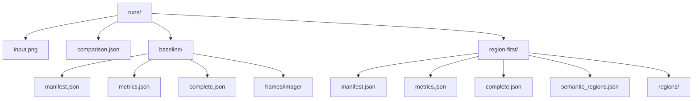
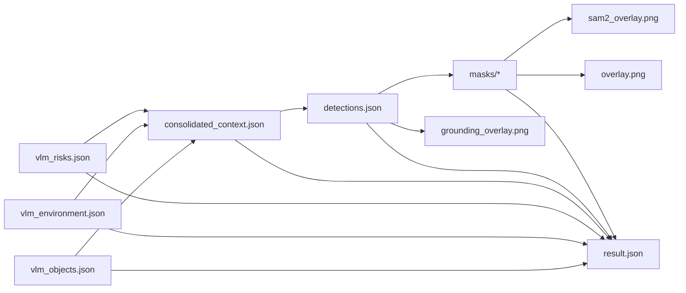
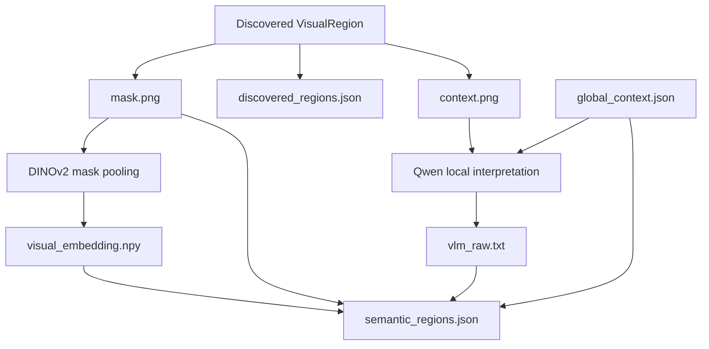
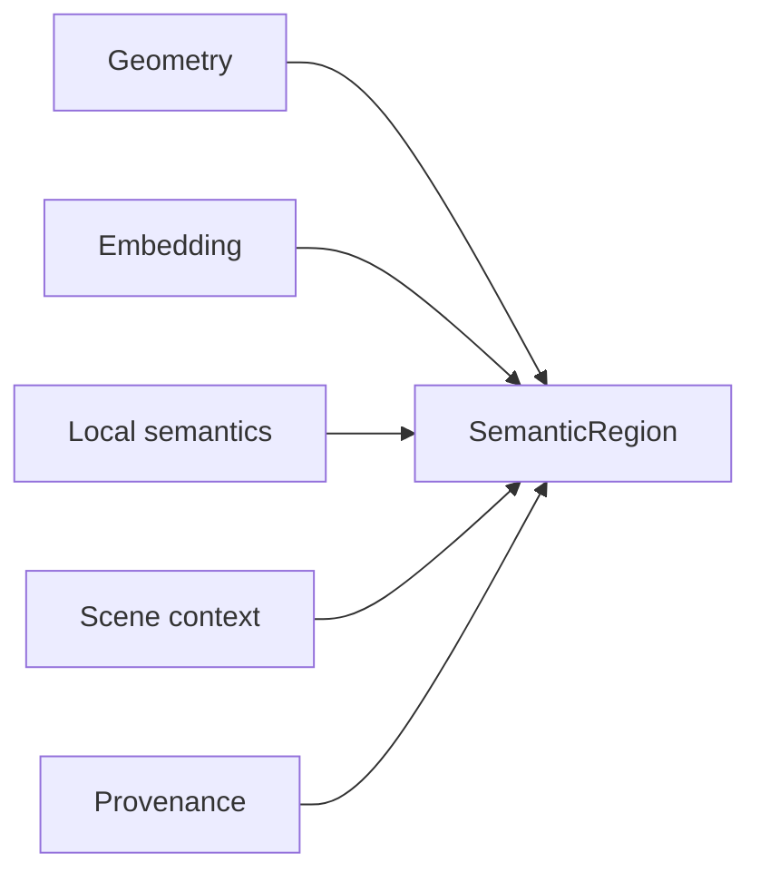
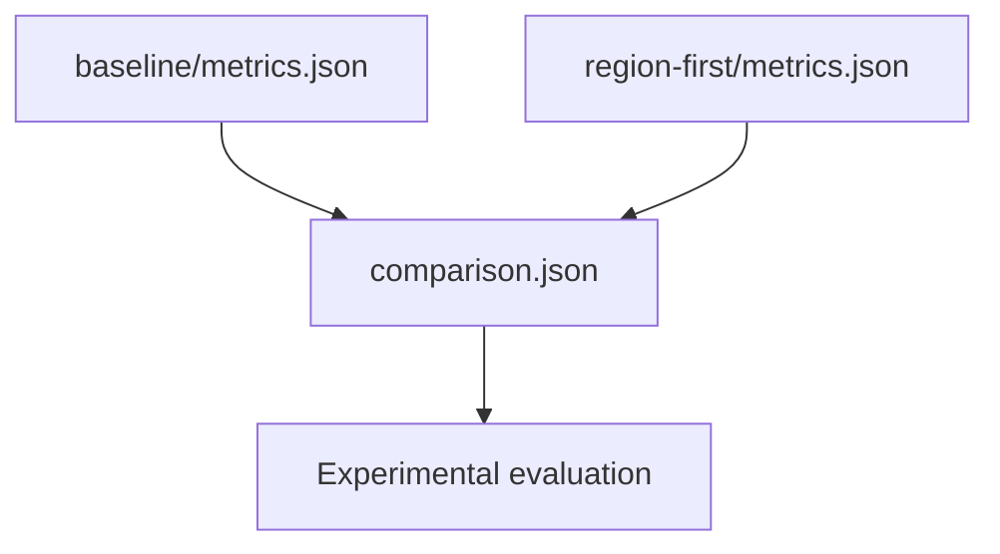
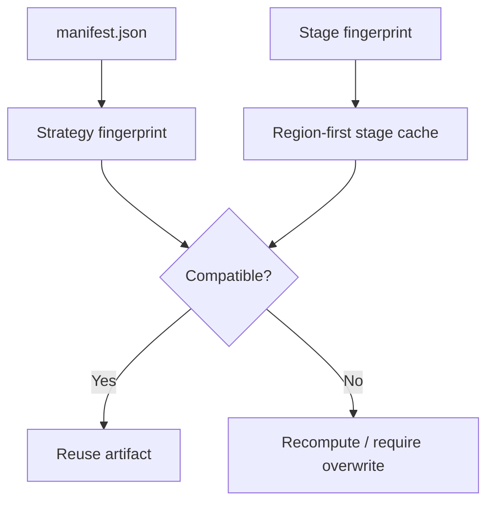
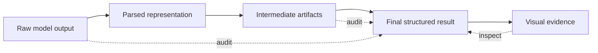

# Artifacts

Os artefatos persistidos fazem parte da arquitetura do projeto. Eles permitem auditoria, comparação, retomada e reprocessamento sem repetir etapas caras.

## Execução comparativa

Ao usar `image-context analyze --strategy all`, a estrutura conceitual é:

```text
runs/<run-id>/
├── input.png
├── comparison.json
├── baseline/
└── region-first/
```



## Baseline

A saída principal por imagem contém os resultados das três passagens VLM, conceitos consolidados, detecções e segmentações.

```text
baseline/
├── manifest.json
├── metrics.json
├── complete.json
├── input.png
└── frames/
    └── image/
        ├── vlm_objects.json
        ├── vlm_environment.json
        ├── vlm_risks.json
        ├── consolidated_context.json
        ├── detections.json
        ├── result.json
        ├── grounding_overlay.png
        ├── sam2_overlay.png
        ├── overlay.png
        └── masks/
```

### Relação dos dados



## Region-first

A estratégia region-first persiste a descoberta geométrica antes de semântica e mantém um subdiretório por região.

```text
region-first/
├── manifest.json
├── complete.json
├── metrics.json
├── input.png
├── discovered_regions.json
├── dense_features_complete.json
├── vlm_global_raw.txt
├── global_context.json
├── global_complete.json
├── semantic_regions.json
├── region_overlay.png
└── regions/
    └── <region-id>/
        ├── mask.png
        ├── visual_embedding.npy
        ├── context.png
        ├── vlm_raw.txt
        └── vlm_complete.json
```

### Ciclo de uma região



## `semantic_regions.json`

Esse arquivo funciona como a representação estruturada principal do region-first. Cada região semântica combina:

- identificador estável da região;
- caminho da máscara;
- bounding box;
- confiança geométrica;
- label e descrição;
- atributos e condição;
- confiança semântica;
- caminho e dimensão do embedding visual;
- relações candidatas;
- proveniência.



## Métricas

As duas estratégias produzem `metrics.json` para facilitar comparação experimental.

As métricas podem incluir:

- tempo total;
- tempo por estágio;
- número de regiões semânticas;
- regiões rotuladas;
- confiança média;
- chamadas ao VLM;
- pico de VRAM;
- regiões descobertas e descartadas no region-first;
- imagens concluídas/falhas no baseline.



## Manifest e cache

`manifest.json` registra a identidade da execução e sua estratégia. Marcadores adicionais registram fingerprints por estágio.



## Auditoria

A persistência deliberada de respostas brutas, máscaras, embeddings, thresholds indiretos via manifest/configuração e overlays permite reconstruir por que uma região ou detecção apareceu no resultado final.


