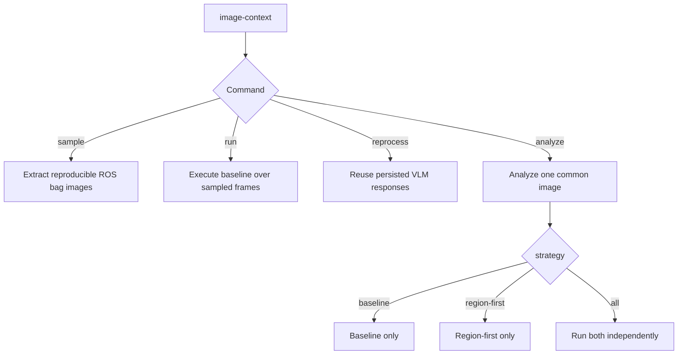
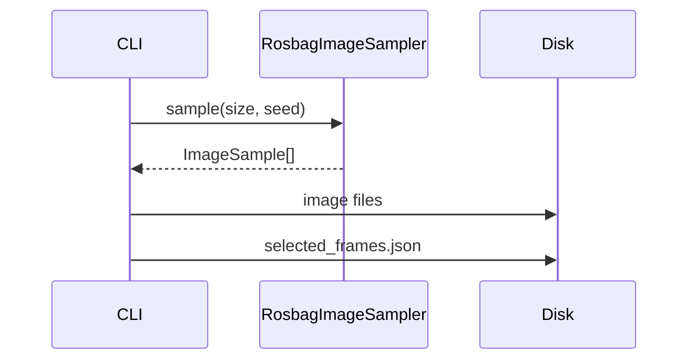
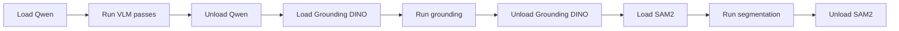
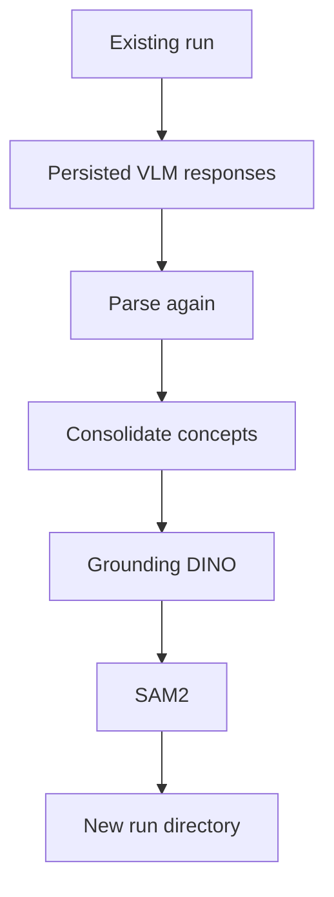
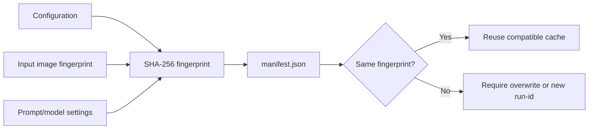
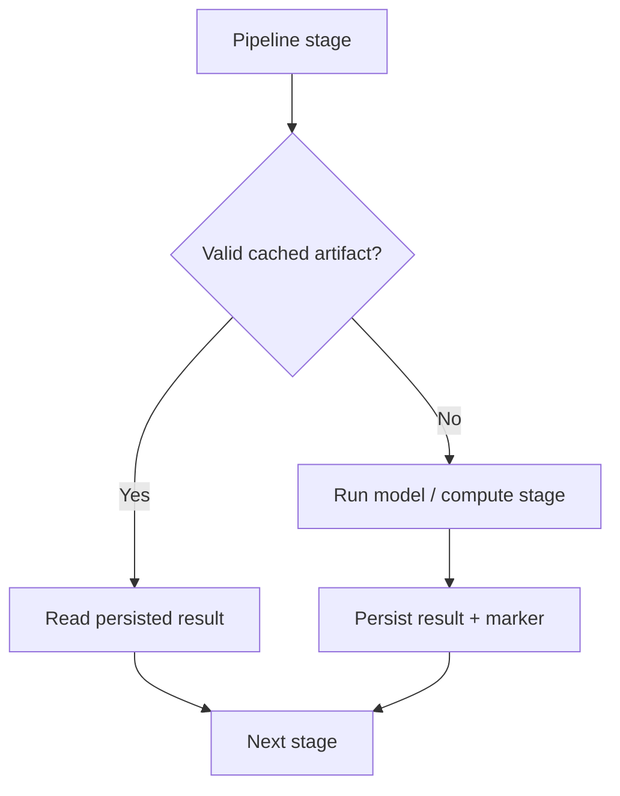
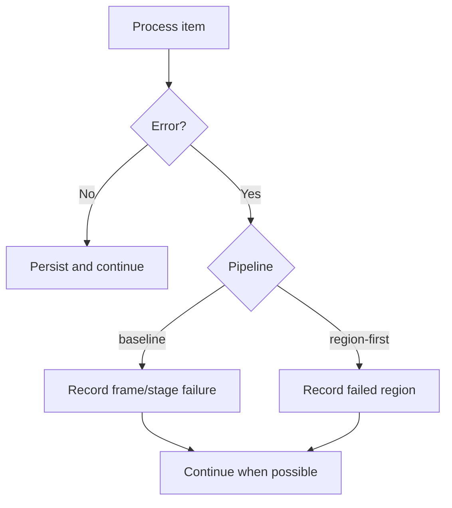

# Execution

## CLI

O projeto expõe quatro modos principais:

```bash
image-context sample --config config.yaml
image-context run --config config.yaml
image-context reprocess --config config.yaml --source-run runs/<run-id>
image-context analyze --config config.yaml --image path/to/image.png --strategy all
```

## Fluxo dos comandos



## `sample`

Extrai imagens do ROS bag conforme `sample_size` e `seed`, sem carregar os modelos pesados.



## `run`

Executa o baseline sobre as imagens amostradas do dataset configurado.

A ordem de residência dos modelos é deliberada:



## `reprocess`

`reprocess` evita executar novamente o Qwen quando as respostas VLM persistidas já são adequadas para um novo experimento de parsing, thresholds, grounding ou segmentação.



## `analyze`

`analyze` normaliza uma imagem comum para `input.png` e executa uma ou duas estratégias.

```bash
image-context analyze \
  --config config.yaml \
  --image path/to/image.png \
  --strategy all \
  --run-id comparison-01
```

Valores válidos para `--strategy`:

- `baseline`
- `region-first`
- `all`

## Fingerprints

Cada execução usa fingerprints derivados da configuração e da entrada. Eles impedem reutilização silenciosa de artefatos incompatíveis.



Na estratégia region-first também existem fingerprints por estágio, como:

- `region-discovery`
- `dense-features`
- `vlm-global-local`
- `fusion`

Isso permite invalidar apenas o estágio cuja configuração mudou.

## Retomada

A execução consulta artefatos persistidos antes de processar novamente etapas caras.



No baseline, isso inclui respostas VLM, detecções e máscaras. No region-first, inclui regiões descobertas, embeddings e respostas VLM globais/locais.

## Isolamento de falhas

Os pipelines tentam manter falhas localizadas.



A estratégia region-first, em particular, pode produzir resultado parcial quando uma interpretação local falha, sem necessariamente descartar todas as demais regiões.

## Qualidade

```bash
pytest
ruff check .
mypy
```
