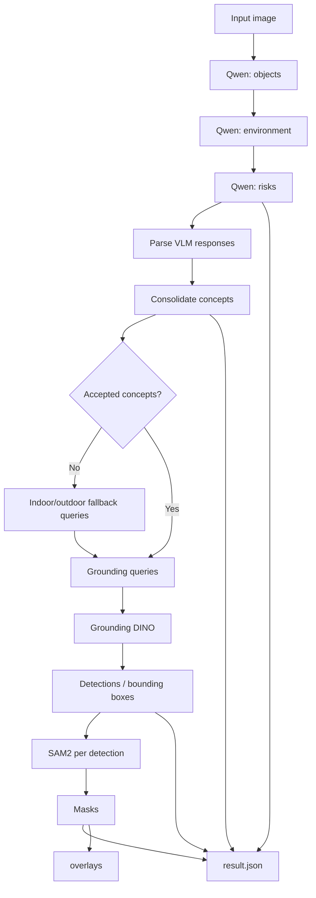
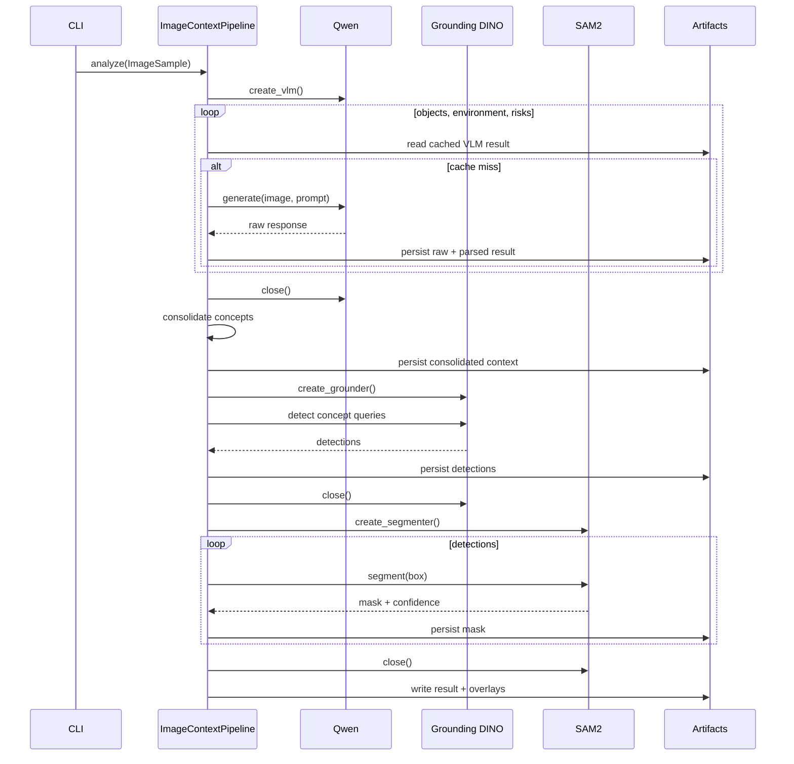
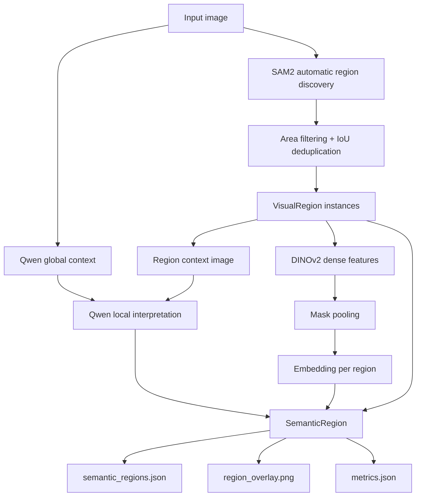
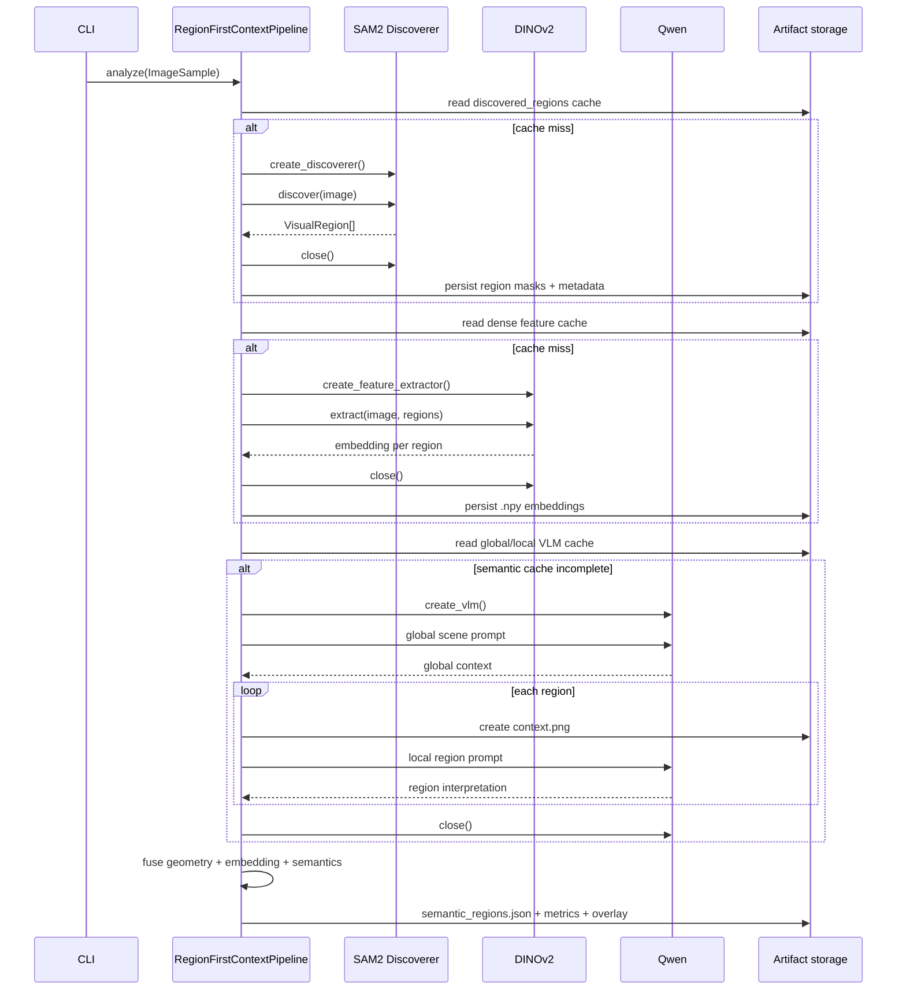
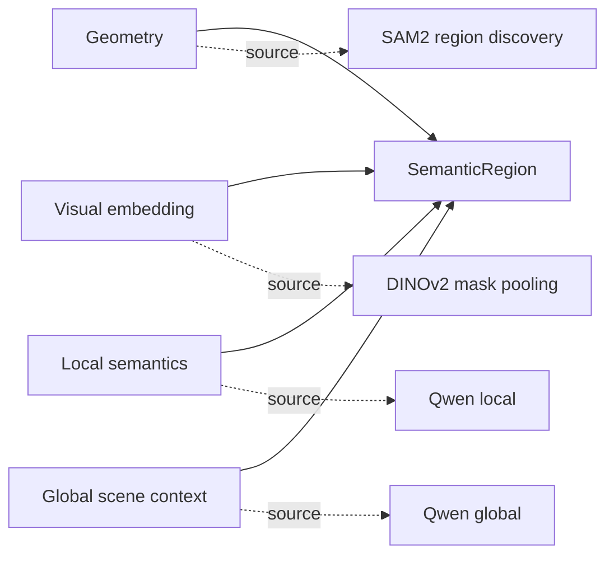
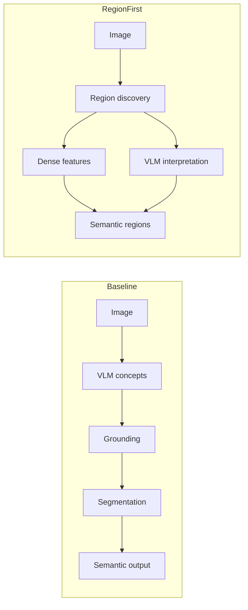
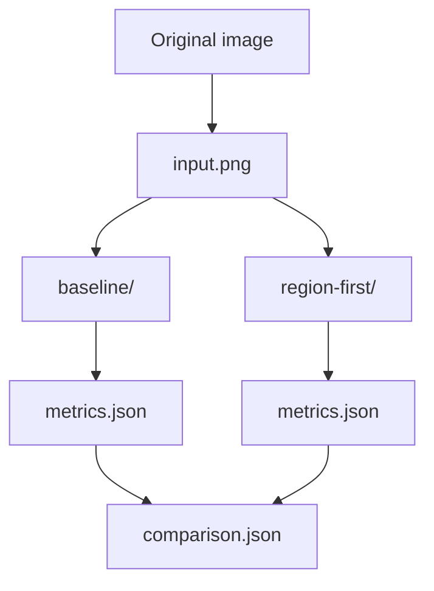

# Pipelines

## Baseline

A estratégia `baseline` é VLM-first. O VLM determina quais conceitos devem ser procurados antes do grounding e da segmentação.

### Sequência

### Característica principal

O recall depende inicialmente do que o VLM propõe como conceito. Se um objeto ou região não for proposto, ele não chega naturalmente às etapas de Grounding DINO e SAM2. O fallback reduz casos vazios, mas continua sendo um conjunto de consultas configuradas.

## Region-first

A estratégia `region-first` inverte a ordem. Primeiro descobre evidência visual; depois atribui semântica.

### Sequência

### Proveniência

Cada `SemanticRegion` mantém separadas as origens da informação:

Isso permite auditar qual modelo forneceu geometria, representação visual e interpretação textual.

## Comparação conceitual

| Aspecto | Baseline | Region-first |
| --- | --- | --- |
| Primeiro sinal | texto/semântica | geometria visual |
| Descoberta | Grounding por conceito | regiões class-agnostic |
| Segmentação | depois da detecção | início do pipeline |
| Features densas | não | DINOv2 por máscara |
| VLM | 3 passagens globais | global + uma interpretação por região |
| Unidade final | detecção segmentada | `SemanticRegion` |
| Risco principal | conceito não proposto | excesso/fragmentação de regiões |

## Execução conjunta

Com `--strategy all`, as duas estratégias recebem a mesma imagem normalizada.

Essa execução não representa uma fusão entre as estratégias. Ela é uma comparação controlada entre dois pipelines independentes.
